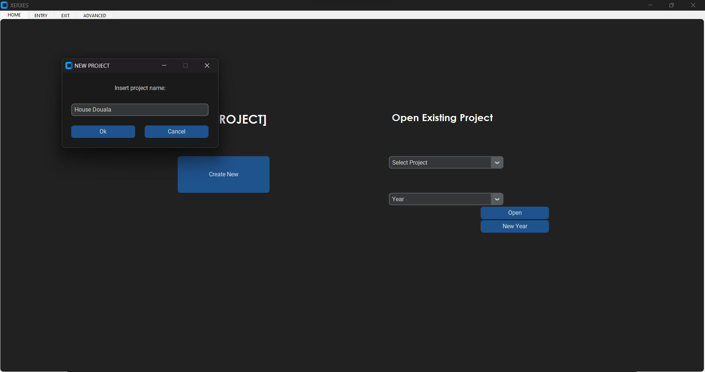
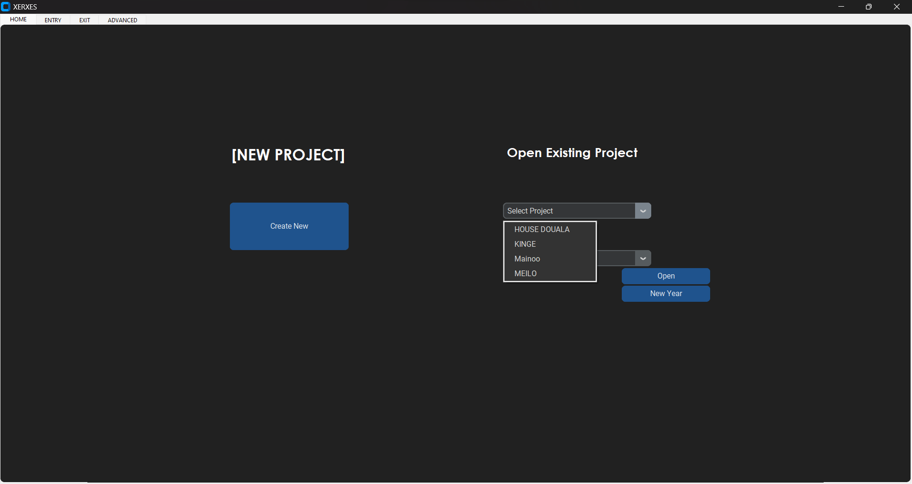
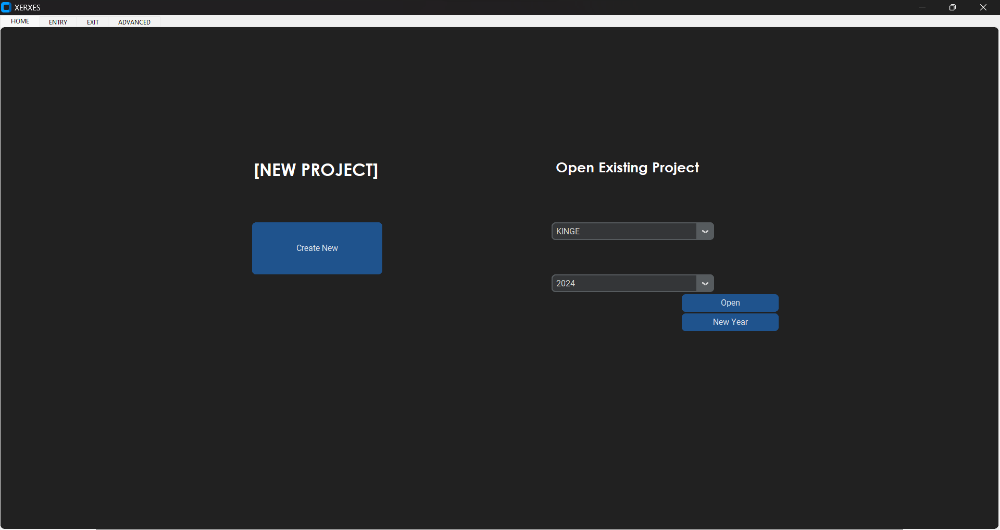
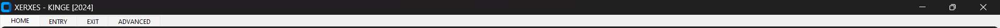
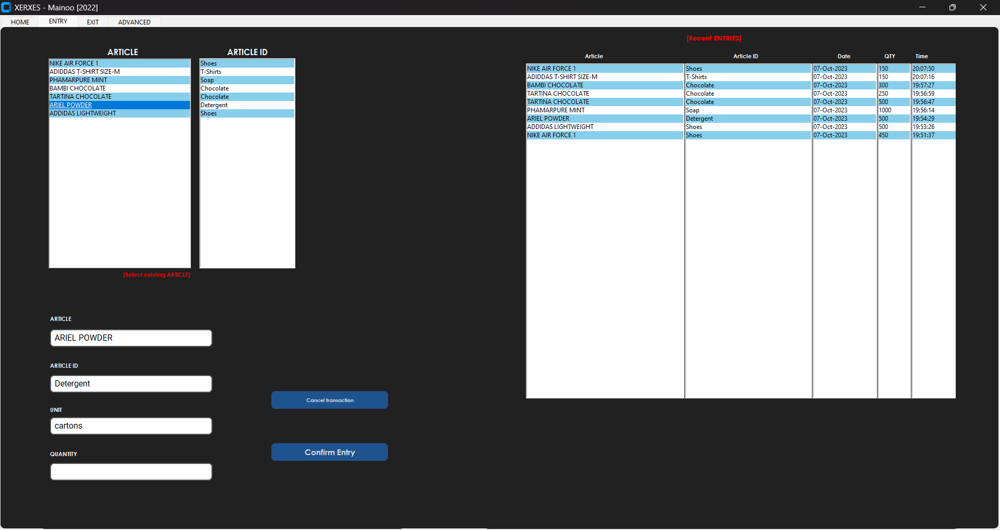
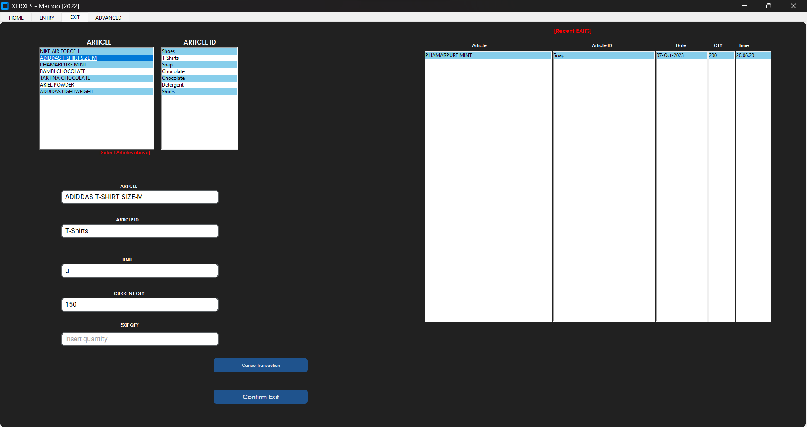
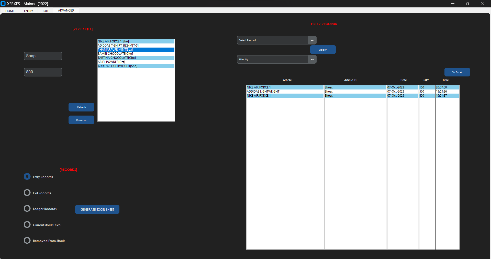

# Inventory Management App

This GUI inventory management system can be used by any individual to manage stock and it is 'Database-less' and was built solely with the Python **Tkinter GUI Toolkit**, **CustomTkinter Toolkit**, **Pandas Library** and CSV files. It can also be used in filtering your data based on certain preferences chosen.  


## Interface

1. HOME Tab
   - Create a new directory for a new Project / Warehouse / Store by clicking the **Create New** button
     

   - Open an already project by selecting from the **Select Project** entry box and also selecting the **Year** to succesfully open this project
     
     

   - For an existing Project, click the **New Year** button record transactions for the current year
   - The **Title Bar** will reflect the name of the opened project
     

2. ENTRY & EXIT Tab
   - For **Entry Tab** select article from **ARTICLE** box if article already exists or Enter new article data in corresponding fields
   - For **Exit Tab** select article from **ARTICLE** box
   - See recent Entries / Exits right side of the respective Tab
     
     

3. ADVANCED Tab
   - Easily verify the quantity of any article by selecting the article
   - Print any record from the options available
   - Filter record data based on the available preferences
     
## Project Setup

This project requiresPython >=3.7. To get started, follow the steps below:

1. **Clone the Repository:** Begin by cloning this repository to your local machine using the following command:  
   ```https://github.com/Nekembe-Boris/Inventory-Management-Desktop-App.git```


2. **Install Requirements:**  
```
pip3 install -r requirements.txt
```

3. Run **main.py**

### Consideration while running the application
   - This application should not be opened on a screen larger than 19 inches as it will change the UI. CustomTkinter (a modern and customizable python UI-library based on Tkinter) is yet to be fully able to integrate with Tkinter
